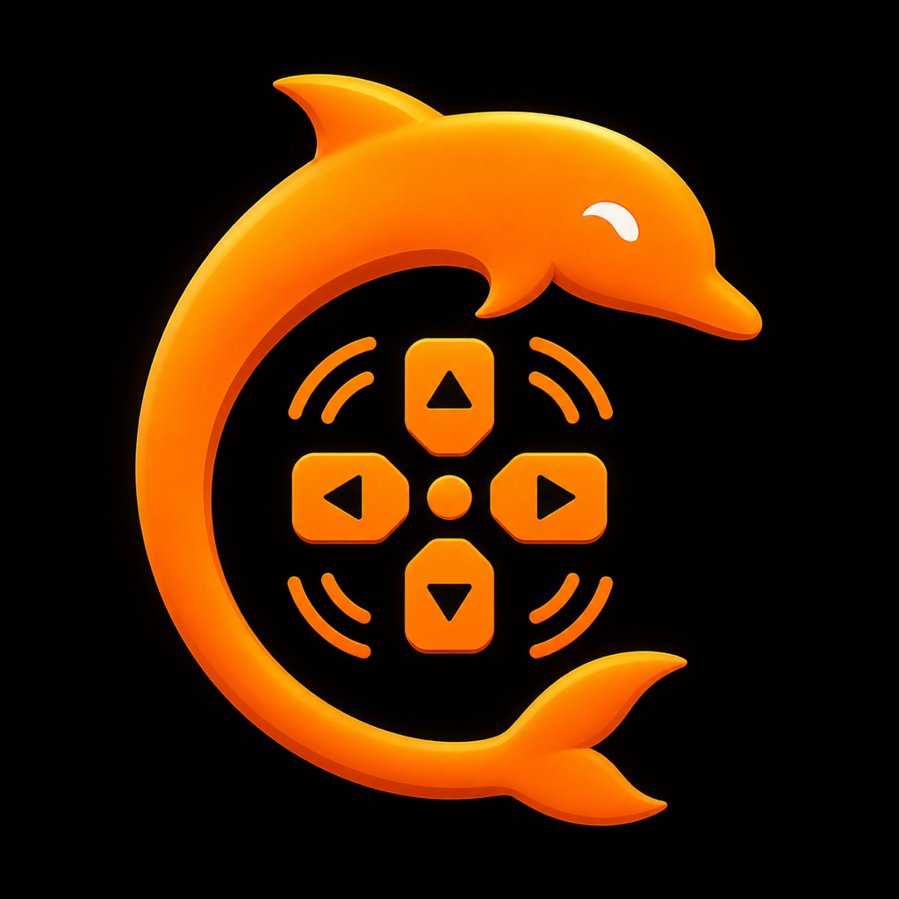

# Dolphin Deck 1.1.0

<p align="center">
  
</p>

Dolphin Deck ist eine native SwiftUI-Begleit-App für den Flipper Zero. Sie
verbindet sich per Bluetooth LE und verwendet das offizielle Flipper-RPC-
Protokoll für Fernsteuerung, Displayübertragung, Dateien, File Favorites,
Kurzbefehle und App-Installation.

> Dolphin Deck ist ein unabhängiges Projekt und nicht offiziell mit Flipper
> Devices verbunden.

## Funktionen

- automatische Suche, Kopplung und Wiederverbindung per Bluetooth LE
- Hintergrundmodus `bluetooth-central`
- Live-Übertragung des 128×64-Flipper-Displays
- Remote-Tasten mit serieller Warteschlange statt paralleler RPC-Aufrufe
- feststehender Tastenverlauf am unteren Rand der Remote-Seite
- offizielle RPC-Entsperrung einer bereits vertrauenswürdig gekoppelten Verbindung
- Geräteinformationen für Firmware, Hardware, Akku, Funk und System
- kompatible Verwaltung der Flipper-File-Favorites-Datenbank
- versionierte lokale Backups und Backup-Spiegel auf dem Flipper
- vollständiger Dateimanager für SD-Karte und internen Speicher
- Mehrfachauswahl mit Kopieren, Ausschneiden, Einfügen, Verschieben und Löschen
- Datei-Upload und kompletter Ordnerimport
- Text-, Struktur- und Hex-Vorschau
- lokaler und HTTPS-basierter FAP-Installer
- uFBT-Quellcode-Build über einen eigenen Build-Host
- Home- und Sperrbildschirm-Widget
- Apple-Kurzbefehle für Verbindung, Status, Alarm, Tasten, Favoriten und Datei-Upload
- direkte Siri-/Widget-Schnellaktion für bevorzugte Sub-GHz-Signale
- eigene **Dolphin Deck Bridge** als Flipper-FAP
- bidirektionale DD1-Kommandos über das offizielle Application-RPC
- iPhone-Suchhinweis mit Ton, Vibration und lokaler Mitteilung
- Ein-Klick-Installation und Aktualisierung der Bridge-FAP aus GitHub
- optionaler ESP32-BLE-HID-Modus für Lautstärke und Mediensteuerung
- optionaler nRF24-Langstreckenmodus mit zweitem ESP32 als BLE-Gateway

Die Apple-Watch-App ist in Version 1.1.0 bewusst nicht enthalten.

## Voraussetzungen

- iPhone oder iPad mit iOS/iPadOS 17 oder neuer
- Mac mit einer aktuellen Xcode-Version
- kostenloses oder kostenpflichtiges Apple-Developer-Team in Xcode
- Flipper Zero mit aktiviertem Bluetooth und kompatiblem RPC-Protokoll
- optional: Python 3 und `ufbt` für den Quellcode-Build-Host

## Installation auf iPhone oder iPad

Im GitHub-Release liegen diese Downloads:

- `DolphinDeck_1.1.0_Source.zip` enthält das vollständige Xcode-Projekt.
- `dolphin_deck_bridge.fap` ist die fertige Flipper-App.
- `dolphin_deck_bridge.fap.sha256` wird von der iPhone-App zur
  Integritätsprüfung verwendet.

Eine Development-IPA wäre immer an die im jeweiligen Provisioning Profile
registrierten Geräte gebunden. Die iPhone-App wird deshalb aus dem Xcode-
Projekt mit dem eigenen Apple-Developer-Team signiert.

1. Repository herunterladen oder klonen.
2. `DolphinDeck.xcodeproj` in Xcode öffnen.
3. Links das Projekt **DolphinDeck** auswählen.
4. Bei den Targets `DolphinDeck` und `DolphinDeckWidget` unter
   **Signing & Capabilities** dasselbe Developer-Team einstellen.
5. Falls Xcode einen Bundle-ID-Konflikt meldet, diese IDs eindeutig ändern:
   - `de.lukasleipacher.DolphinDeck`
   - `de.lukasleipacher.DolphinDeck.Widget`
6. Bei geänderten IDs außerdem in App und Widget dieselbe eigene App Group
   eintragen.
7. Das verbundene iPhone oder iPad als Ziel auswählen.
8. Einmal **Product → Clean Build Folder** und danach **Run** ausführen.

Nach erfolgreicher Installation muss unter **Mehr → Einstellungen** die Version
`1.1.0` angezeigt werden.

## Flipper verbinden

1. Am Flipper **Settings → Bluetooth** öffnen und Bluetooth aktivieren.
2. In Dolphin Deck den Tab **Flipper** öffnen.
3. Suche starten und den gefundenen Flipper auswählen.
4. Kopplungsabfrage auf beiden Geräten bestätigen.
5. Warten, bis **RPC bereit** angezeigt wird.

Die App versucht anschließend, die bekannte Verbindung automatisch
wiederherzustellen. Ein manuell aus dem App-Umschalter beendeter Prozess muss
von iOS erneut geöffnet werden.

## Remote und Entsperren

Die Remote-Seite startet nach einer RPC-Verbindung automatisch die
Displayübertragung. Schnelle Tastendrücke werden intern in der eingegebenen
Reihenfolge gesammelt und einzeln gesendet. Dadurch laufen keine konkurrierenden
Tasten-RPCs gegeneinander.

Der Verlauf liegt in einer konstant hohen Leiste am unteren Rand. Er verändert
die Position der Fernbedienung nicht, wenn neue Tasten hinzukommen.

**Flipper entsperren** verwendet den offiziellen `desktop.unlock`-RPC. Dolphin
Deck kennt und speichert dabei keine Flipper-PIN. Der Befehl funktioniert nur
über eine bereits gekoppelte und RPC-bereite Verbindung.

## Dateimanager und Stapelaktionen

Der Dateimanager liegt unter **Mehr → Dateimanager**.

1. Auf den Kreis neben einer Datei oder einem Ordner tippen.
2. Weitere Dateien und Ordner auswählen oder oben **Alle** verwenden.
3. In der feststehenden Aktionsleiste oberhalb der Dateiliste eine Operation
   wählen:
   - Kopieren
   - Ausschneiden
   - Einfügen beziehungsweise Verschieben
   - Umbenennen bei genau einem Eintrag
   - Zu File Favorites hinzufügen
   - Löschen
4. Nach Kopieren oder Ausschneiden den Zielordner öffnen und dort
   **Einfügen/Move** wählen.

Ordner werden rekursiv verarbeitet. Vor dem gemeinsamen Löschen erscheint eine
Bestätigung.

## Einzelne Datei über Apple Kurzbefehle senden

Nach der Installation erscheint in der Kurzbefehle-App die Aktion
**Datei an Flipper senden**.

1. In Kurzbefehle eine neue Aktion erstellen.
2. Optional zuerst **Datei auswählen** hinzufügen.
3. Danach **Dolphin Deck → Datei an Flipper senden** hinzufügen.
4. Die vorherige Datei als Eingabe verbinden.
5. Zielordner festlegen, zum Beispiel `/ext/dolphin_deck_uploads`.

Die Aktion verbindet den bekannten Flipper bei Bedarf, wartet auf RPC und lädt
genau eine Datei hoch.

Weitere Aktionen:

- Mit Flipper verbinden
- Flipper-Status
- Flipper finden
- Flipper-Taste drücken
- Flipper-Favorit öffnen
- Flipper-Favorit ausführen / Sub-GHz-Signal senden

Bei einem `.sub`-Favoriten öffnet **Favorit ausführen** den gespeicherten
Sub-GHz-Sender und löst nach dem Laden genau einen OK-Tastendruck aus. Andere
Dateitypen werden wie bisher in ihrer Flipper-App geöffnet.

## File Favorites

Dolphin Deck liest und schreibt die FFF2-Datenbank:

```text
/ext/apps_data/flipper_file_favorites/favorites.cfg
```

Dadurch erscheinen dieselben Einträge in der iOS-App und der
Flipper-File-Favorites-FAP. Änderungen werden zusätzlich gespiegelt nach:

```text
/ext/apps_data/flipper_file_favorites/favorites.bak
/int/flipper_file_favorites/favorites.cfg
```

Importierte Ordner lassen sich aus der Favoritenliste entfernen, ohne ihre
Originaldateien automatisch zu löschen.

## FAP installieren

Unter **Mehr → FAP-Installer & Updates** kann eine lokale `.fap` oder eine
direkte HTTPS-Adresse gewählt werden. Die App überträgt die Datei in den
gewählten `/ext/apps/...`-Ordner und kann sie danach direkt starten.

## Dolphin Deck Bridge auf dem Flipper

Unter **Mehr → Flipper-App & iPhone-Bridge** lässt sich
`dolphin_deck_bridge.fap` direkt aus dem neuesten GitHub-Release laden,
validieren und nach folgendem Pfad übertragen:

```text
/ext/apps/Tools/dolphin_deck_bridge.fap
```

Danach startet Dolphin Deck die FAP über RPC. Die FAP bietet diese Aktionen:

- iPhone suchen
- lokale Mitteilung auslösen
- Lautstärke erhöhen/verringern
- Wiedergabe/Pause
- Home und App-Umschalter über optionales ESP32-BLE-HID
- Sperranfrage mit ehrlicher Nicht-verfügbar-Rückmeldung auf iOS
- Umschalten zwischen direkter iPhone-Bridge und GPIO-Modul

Die Kommunikation verwendet das versionierte Textprotokoll `DD1` innerhalb des
offiziellen bidirektionalen Flipper-Application-RPC. Die Bridge kann in der App
nach jeder Bluetooth-Verbindung automatisch gestartet werden.

### Grenzen von iOS

Dolphin Deck kann einen eigenen hörbaren Suchhinweis und eine lokale
Mitteilung auslösen. Apples geschützter **„Wo ist?“**-Dauerton ist nicht als
öffentliche Drittanbieter-API verfügbar.

Ebenso bietet iOS Apps keine öffentliche API, um das Display zu sperren, den
Home-Befehl auszulösen oder den systemweiten App-Umschalter zu bedienen.
Dolphin Deck verwendet dafür bewusst keine privaten APIs. Lautstärke,
Medientasten und – abhängig vom iOS-Kontext – Hardware-Tastaturkürzel können
stattdessen über ein als Tastatur gekoppeltes ESP32-BLE-HID gesendet werden.

## ESP32 und nRF24

Referenz-Firmware und Verdrahtung liegen unter [Hardware](Hardware/README.md).
Der direkte Aufbau ist:

```text
Flipper GPIO-UART → ESP32 BLE HID → iPhone
```

Für nRF24 sind zwei Funkmodule nötig, da das iPhone selbst kein nRF24
unterstützt:

```text
Flipper → ESP32+nRF24 ⇄ nRF24+ESP32 → BLE HID → iPhone
```

Den Modus stellt man in der Bridge-Seite der iPhone-App ein. Die FAP speichert
ihn zusätzlich auf der SD-Karte. Der UART läuft mit 115200 Baud und 3,3-V-
Logik.

## uFBT: Quellcode unterwegs bauen und installieren

iOS darf die Python-/ARM-Toolchain von uFBT nicht direkt innerhalb der
Apple-Sandbox ausführen. Dolphin Deck verwendet deshalb einen kleinen eigenen
Build-Host:

```text
iPhone → HTTPS/VPN → uFBT Build-Host → .fap → Flipper RPC
```

### Build-Host einrichten

Auf einem Mac oder Linux-Server:

```bash
python3 -m pip install --upgrade ufbt
export UFBT_BUILD_TOKEN="ein-langes-zufälliges-passwort"
python3 Tools/ufbt_build_server.py \
  --host 0.0.0.0 \
  --port 8787 \
  --ufbt "$(command -v ufbt)"
```

Für unterwegs den Dienst über HTTPS oder ein privates VPN wie Tailscale
erreichbar machen. Port `8787` nicht ungeschützt ins öffentliche Internet
weiterleiten.

### In Dolphin Deck

1. **Mehr → uFBT Build & Install** öffnen.
2. Quellcodeordner mit `application.fam` auswählen.
3. HTTPS-Adresse des Hosts und dasselbe Token eintragen.
4. Zuerst **Verbindung zum Build-Host testen** drücken.
5. Zielkategorie auswählen.
6. **Mit uFBT bauen und installieren** drücken.

Das Zugriffstoken wird im iOS-Schlüsselbund gespeichert. Build-Ausgabe und
Fehler werden direkt in der App angezeigt.

Weitere Host-Details stehen in [Tools/README.md](Tools/README.md).

## Widget

App und Widget verwenden standardmäßig die App Group:

```text
group.de.lukasleipacher.DolphinDeck
```

Wenn Bundle-IDs geändert werden, muss eine eigene App Group in
`DolphinDeck.entitlements` und `DolphinDeckWidget.entitlements` identisch
hinterlegt werden. Danach App einmal starten und das Widget über den
iOS-Widget-Dialog hinzufügen.

Das Widget zeigt bevorzugt den ersten mit einem Stern markierten
Sub-GHz-Favoriten. Ein Tipp öffnet Dolphin Deck per Deep Link, verbindet den
bekannten Flipper und sendet das Signal. Wenn kein `.sub`-Favorit vorhanden
ist, wird stattdessen der erste normale File Favorite geöffnet.

## Projekt bauen

Ein Gerätebuild ohne Signierung:

```bash
xcodebuild \
  -project DolphinDeck.xcodeproj \
  -scheme DolphinDeck \
  -sdk iphoneos \
  -destination 'generic/platform=iOS' \
  CODE_SIGNING_ALLOWED=NO \
  build
```

Die Swift-Package-Abhängigkeiten liegen unter `Packages/Peripheral` und werden
über `Package.resolved` reproduzierbar aufgelöst.

## Fehlerbehebung

### RPC ist nicht bereit

- Bluetooth am Flipper prüfen.
- Verbindung im Tab **Flipper** trennen und neu herstellen.
- Andere Flipper-Desktop-/Mobil-Apps schließen, die dieselbe Verbindung nutzen.

### Widget verlangt ein Development Team

- Bei `DolphinDeck` und `DolphinDeckWidget` dasselbe Team wählen.
- App Group und Bundle-IDs kontrollieren.
- Danach **Product → Clean Build Folder**.

### uFBT-Host antwortet nicht

- `/health` des Hosts im Browser testen.
- Token in App und Umgebungsvariable vergleichen.
- HTTPS-/VPN-Erreichbarkeit und Firewall prüfen.
- Auf dem Host `ufbt --version` ausführen.

## Datenschutz und Sicherheit

- Flipper-Dateien werden direkt zwischen iPhone und Flipper übertragen.
- uFBT-Quellcode wird nur an die vom Benutzer eingetragene Host-Adresse gesendet.
- Das optionale Build-Token liegt im iOS-Schlüsselbund.
- Der Build-Host führt ausschließlich den festen uFBT-Befehl ohne Shell aus.

## Drittanbieter

Das RPC-/Peripheral-Paket basiert auf Teilen der offiziellen
[Flipper iOS App](https://github.com/flipperdevices/Flipper-iOS-App).
Lizenzhinweise stehen in [THIRD_PARTY_NOTICES.md](THIRD_PARTY_NOTICES.md).

---

## Bilderstrecke

<p align="center">
  
</p>

<p align="center">
  
</p>
